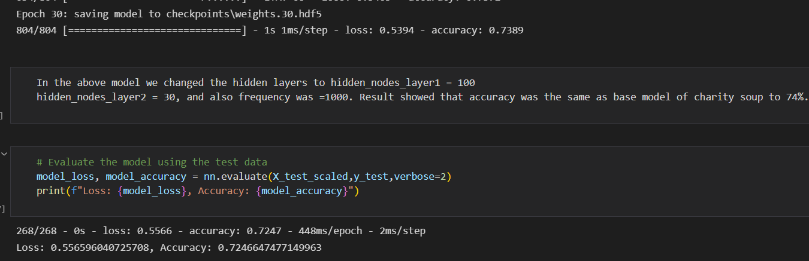
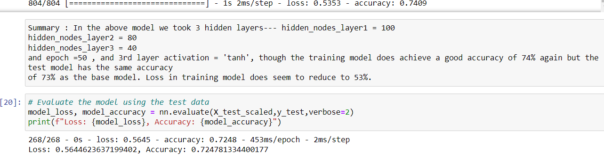
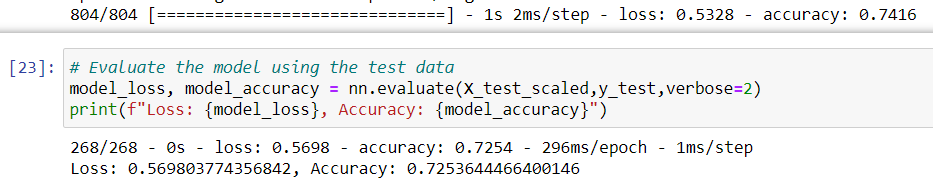

# Neural_Net_Charity_Analysis
## Overview of the analysis:
In this analysis we use our knowledge of machine learning and neural network to create a binary classifier that is capable of predicting whether applicants will be successful if funded by Alphabet Soup. We were provided with a dataset containg various variables on 34,000 organizations that have received funding from Alphabet Soup over the years.
## Results:
- **Data Preprocessing**

- What variable(s) are considered the target(s) for your model?

*The variable IS_SUCCESSFUL is considered as the target for the model as it tells about whether the appication submitted would be successful or not.*

* What variable(s) are considered to be the features for your model?

*Variables considered as features are-- APPLICATION_TYPE, AFFILIATION,	CLASSIFICATION	USE_CASE, ORGANIZATION,	STATUS,	INCOME_AMT,	SPECIAL_CONSIDERATIONS,	ASK_AMT, IS_SUCCESSFUL*

* What variable(s) are neither targets nor features, and should be removed from the input data?

*We removed EIN, and NAME variables as they seemed not to be useful and also not to be included in our analysis. The goal of the analysis was to look at the prediction on whether the organizations would be successful in carrying out the work assigned by the charity organization.*

**Compiling, Training, and Evaluating the Model**

- *How many neurons, layers, and activation functions did you select for your neural network model, and why?*

For the initial model I selected 2 hidden layes with relu and sigmoid as the activation function. For 1st layer 80 neurons and 20 neurons for the 2nd layer. I actually trained the model two times in my main model by changing only 2nd layer of neurons. (in the second i took 30neurons) . I got the exact accuracy and loss in my training and test models, for both. These steps were done so that the  model can provide the additional accuracy scoring metric and train over a maximum of 50 epochs.

* *Were you able to achieve the target model performance?*

The training model was able to achieve 74% accuracy which was quite close to target. 

* *What steps did you take to try and increase model performance?*

In order to improve the model I tried three more attempts.  We tried different combinations to look for better model to reach the target of 75%.

- In the first attempt as seen below I received an accuracy score of 74% in training model.

 

- Next I again ran the model 2nd time and had 3 hidden layers,with activation layer changed to 'tanh', but found out that the accuracy score of training model was  

- In the last attempt even though the hidden layers were changed as hidden_nodes_layer1 = 90
hidden_nodes_layer2 = 50 still I got the same accuracy score of 74% as shown below.

All the above models had different layers and also the activation layer and epoc were changed for each one of them still the closest accuracy for training model achieved was 74%.

## Summary:

Overall, the base model and subsequently the other three models were able to produce an accuracy score of 74%. Even though we tried different combinations as mentioned above the model had same predictability.
In order to improve we can optimize our model by removing or adding more features/ variables to the dataset. I think Random forest classifiers are better type of ensemble learning models that combines multiple smaller models into a more robust and accurate model, and can be used instead. Since, Structurally speaking, random forest models are very similar to their neural network counterparts and have been a staple in machine learning algorithms for many years due to their robustness and scalability it might give us a better accuracy. As they have fasterperformance and also can handel overfitting of any model.